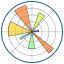

<h1 align="center">

  

</h1>

<h3 align="center">A dedicated data analyst from Berlin 🍻</h3>

 

 
<h3>In my journey, I strive to:</h3>

  🌐 Navigate the vast seas of data with precision and curiosity  
  🔍 Unearth hidden insights and patterns that tell compelling stories  
  🛠️ Craft visualizations that illuminate the data's narrative  

 <h3>My toolkit includes:</h3>

  Python 🐍 | Pandas | NumPy for data manipulation and analysis  
  SQL 🗃️ for structured data exploration  
  Data Visualization 🎨 | Matplotlib | Seaborn | Tableau for bringing data to life  

  
  

 
<h2 align="center">📚 Data Tools & Frameworks 📚</h2>
 

    
    
    
    
    

    
    
    
    
    
    
    
    

 
  <h3>✨ Inspiration:</h3>
  
  
I find inspiration in the patterns of nature and the rhythm of everyday life. 
  Data is everywhere, and I'm fascinated by how it mirrors the world around us.

 <h3>🤝 Let's Connect:</h3>
 
 
I’m always eager to collaborate on exciting projects or just chat about the latest in data science and analytics. Feel free to reach out or connect with me!

